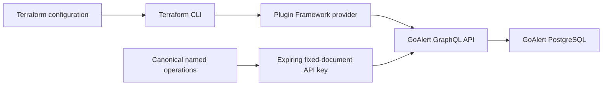

# Terraform Provider for GoAlert

A small Terraform Plugin Framework provider for self-hosted GoAlert.
The first milestone, **v0.0.1 candidate**, manages `goalert_service`.
The repository is private; no Registry publication or production adoption is implied.



## Prerequisites

- Go 1.25 or newer (Framework v1.19.0), Terraform 1.10 or newer.
- GNU Make, Python 3.10+, Docker Engine and Docker Compose v2 for acceptance tests.
- A GoAlert installation and an existing escalation policy.
- An admin-role GraphQL API key created with the exact operations in
  [operations.graphql](internal/client/operations.graphql). Do not use an incoming-alert integration key.
- HTTPS for network endpoints; loopback HTTP is supported for development.

## Start learning

```console
make poc
make test
make build
make acceptance
```

The PoC runs before Terraform: real GoAlert v0.34.1 and PostgreSQL 17 in isolated
containers, with generated credentials, a loopback-only HTTP port and ephemeral
database storage. The acceptance suite then exercises the actual provider binary
through Terraform. Both commands tear down only their own Compose project.

[Design and evidence](docs/design.md) explains the API constraints and Framework
lifecycle. [Development](docs/development.md) explains private `dev_overrides`
installation on Windows and Linux. [Releases](docs/releases.md) describes signed
packages and the independent publication decisions.

## Configure a service

Supply the endpoint and key through `GOALERT_ENDPOINT` and `GOALERT_API_KEY`.
The endpoint is the full GraphQL URL, for example
`https://alerts.example.com/api/graphql`; reverse-proxy prefixes are supported.

```hcl
terraform {
  required_providers {
    goalert = {
      source = "healdropper/goalert"
    }
  }
}
provider "goalert" {}

resource "goalert_service" "api" {
  name                 = "Example API"
  description          = "Owned by the API team"
  escalation_policy_id = var.escalation_policy_id
}
```

This source address is the provider identity, **not an assertion that it exists in
the public Registry**. While private, follow the development instructions; do not
run Registry initialization for an unpublished provider.

See the [provider](docs/index.md), [service](docs/resources/service.md), and
[examples](examples/resources/goalert_service/main.tf) reference.

## Scope and next versions

v0.0.1 covers service CRUD, UUID import, drift and remote deletion.
Existing escalation policies remain outside this resource's ownership.
A service with an empty policy is not a usable alert-routing solution.
Subsequent v0.0.x increments should add escalation policies and steps, then
integration keys as a concrete consumer requires them. Each increment needs a
PoC, acceptance coverage and a reviewed canonical-document/key migration.
Schedules, rotations, users and notification methods are separate contracts.

Source files and the canonical document are hand-maintained. Do not edit
`go.sum` manually. The provider uses no environment-specific service names,
addresses, Kubernetes assumptions or deployment credentials.

License: [MPL-2.0](LICENSE).

## Specifications and delivery

[Vision](docs/specs/00_VISION.md), [architecture](docs/specs/01_ARCHITECTURE_ADR.md)
and [service contract](docs/specs/goalert-service.md) distinguish accepted task
scope from observed implementation. See the [baseline](docs/sprints/sprint-0-baseline.md),
[roadmap](docs/roadmap.md) and [proposed Sprint 1](docs/sprints/sprint-1.md).
The [pinned lifecycle](docs/specs/spec-driven-lifecycle.md) governs future work.

For possible future source-to-chat delivery, review the
[proposed capability contract](docs/specs/alert-delivery.md) and
[milestone options](docs/milestones/alert-delivery.md). These are planning
proposals; the provider currently implements services only.
