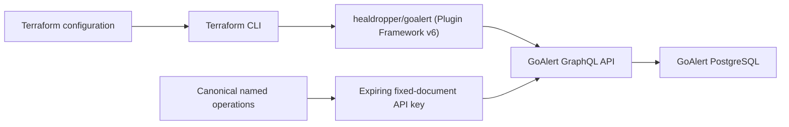

# Terraform Provider for GoAlert (`healdropper/goalert`)

A [Terraform Plugin Framework](https://developer.hashicorp.com/terraform/plugin/framework) (Protocol v6) provider for declaratively managing self-hosted [GoAlert](https://goalert.me/) (`v0.35.0`) installations through GoAlert's GraphQL API.



## Capabilities (`v1.0.0` GA — 100% GoAlert v0.35.0 Coverage)

- **14 Managed Resources**:
  - **Services & Ingress**: [`goalert_service`](docs/resources/service.md), [`goalert_integration_key`](docs/resources/integration_key.md), [`goalert_heartbeat_monitor`](docs/resources/heartbeat_monitor.md), [`goalert_service_label`](docs/resources/service_label.md), [`goalert_label`](docs/resources/label.md) (polymorphic across `service`, `escalationPolicy`, `schedule`, and `rotation`).
  - **Escalation Policies**: [`goalert_escalation_policy`](docs/resources/escalation_policy.md) (ordered steps with `user_ids`, `rotation_ids`, `schedule_ids`, `webhook_urls`, and `multi_ack`).
  - **Users & Notification Channels**: [`goalert_user`](docs/resources/user.md), [`goalert_user_contact_method`](docs/resources/user_contact_method.md) (`SMS`, `VOICE`, `EMAIL`, `WEBHOOK`, `SLACK_DM`, `enable_status_updates`, `private`), [`goalert_user_notification_rule`](docs/resources/user_notification_rule.md).
  - **Rotations & Schedules**: [`goalert_rotation`](docs/resources/rotation.md), [`goalert_schedule`](docs/resources/schedule.md), [`goalert_schedule_rule`](docs/resources/schedule_rule.md), [`goalert_user_override`](docs/resources/user_override.md).
  - **System Governance**: [`goalert_system_limit`](docs/resources/system_limit.md).
- **9 Data Sources**:
  - [`goalert_service`](docs/data-sources/service.md), [`goalert_escalation_policy`](docs/data-sources/escalation_policy.md), [`goalert_integration_key`](docs/data-sources/integration_key.md), [`goalert_heartbeat_monitor`](docs/data-sources/heartbeat_monitor.md), [`goalert_user`](docs/data-sources/user.md), [`goalert_rotation`](docs/data-sources/rotation.md), [`goalert_schedule`](docs/data-sources/schedule.md), [`goalert_slack_channel`](docs/data-sources/slack_channel.md), [`goalert_slack_user_group`](docs/data-sources/slack_user_group.md).

## Quick Start

1. In your GoAlert installation (*Admin -> API Keys -> Create API Key*), create an **Admin**-role System GraphQL API key bound to the canonical operations document in [`internal/client/operations.graphql`](internal/client/operations.graphql).
2. Export `GOALERT_ENDPOINT` (for example, `https://alerts.example.com/api/graphql`) and `GOALERT_API_KEY`.
3. Configure the provider from the HashiCorp Terraform Registry:

```hcl
terraform {
  required_version = ">= 1.10.0"

  required_providers {
    goalert = {
      source  = "healdropper/goalert"
      version = "~> 1.0"
    }
  }
}

provider "goalert" {}

resource "goalert_escalation_policy" "oncall" {
  name        = "Primary On-Call"
  description = "Managed by Terraform"
  repeat      = 3

  step {
    delay_minutes = 5
    multi_ack     = false
    webhook_urls  = ["https://hooks.example.com/goalert"]
  }
}

resource "goalert_service" "api" {
  name                 = "Example API"
  description          = "Owned by the API team"
  escalation_policy_id = goalert_escalation_policy.oncall.id
}
```

## Local Development & Disposable Acceptance Suite

Prerequisites: Go `1.25+`, Terraform `1.10+`, Python `3.10+`, GNU Make, Docker Engine, and Docker Compose v2.

```console
make check-format
make test
make vet
make build
make acceptance
```

`make acceptance` launches an isolated `goalert/goalert:v0.35.0` + `postgres:17-alpine` stack with ephemeral credentials on loopback HTTP, provisions a canonical API key, and exercises the compiled provider binary through real Terraform `plan`, `apply`, `import`, drift-remediation, and `destroy` lifecycles across all 14 resources and 9 data sources.

## Documentation & Governance

- [Provider & Resource Documentation](docs/index.md)
- [Design & GraphQL Constraints](docs/design.md)
- [Local Development (`dev_overrides`)](docs/development.md)
- [Signed Releases & Registry Publication](docs/releases.md)
- [Public Repository Governance Specification](docs/specs/public-repository-governance.md)
- [Contributing Guide](CONTRIBUTING.md) & [Security Policy](SECURITY.md)
- License: [MPL-2.0](LICENSE)
