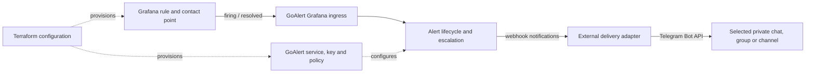

# RFC: declarative alert delivery to a chat destination

Status: Proposed technical contract; accepted product direction is recorded below.
No resource schema or implementation is accepted here.
Owner and decision maker: healdropper. Research date: 2026-09-21.
Track: C (new capability), not a defect against the service milestone.
Related: [research](../research/alert-delivery-feasibility.md),
[milestone options](../milestones/alert-delivery.md), [roadmap](../roadmap.md).
The request authorizes analysis and documentation only.

## Owner direction recorded on 2026-09-21

The owner selected Grafana firing as the first end-to-end scenario and prefers
small provider increments. A Telegram group is preferred for adding people; a
private group is possible, but no bot or group has been selected or provisioned.
Grafana outage detection is a later [availability proposal](grafana-availability.md).

The [Escalation Policies and Webhook Routing planning record](../milestones/escalation-policies-and-webhook-routing.md) and
[Sprint 1](../sprints/sprint-1.md) hold the next increment's boundaries. Detailed
resource behavior, recovery notifications and acknowledgement remain unresolved.
These product decisions do not retroactively accept the full proposed table below.

## Product outcome and scope

An operator receives an actionable notification after a monitored condition
fires, and can correlate its recovery with the same GoAlert incident.
Terraform provisions durable configuration; alert events and Telegram messages
are runtime activity, not Terraform resources or apply-time side effects.

There are two distinct problems:
- A running Grafana evaluates a failing workload or synthetic condition.
- Grafana itself, or its entire host/network, becomes unavailable. This needs
  an independent evaluator or dead-man signal outside the relevant failure
  domain. It cannot rely on that Grafana instance executing its own rule.

Proposed first experiment: one deterministic synthetic rule, one service, one
policy step, one webhook destination and one explicitly selected chat.
No production outage, existing recipient change or real message is authorized
by this RFC. Concrete installation names, addresses and secrets stay with the
consumer. The provider must work for arbitrary GoAlert installations.

## Proposed architecture and ownership

| Concern | Proposed owner | Provider implication |
| --- | --- | --- |
| Rule evaluation, contact point, label routing and grouping | Consumer using the Grafana provider | Do not implement Grafana resources in this provider |
| Service and escalation policy/steps | GoAlert provider | Extend existing service support with a typed policy contract |
| GoAlert incoming integration key | GoAlert provider | Candidate resource with explicit secret and replacement semantics |
| Webhook action/destination | GoAlert provider | Prefer a typed policy action if the API PoC proves it sufficient |
| Payload translation, queue, delivery retries and Telegram token | External adapter, deployed by consumer | No daemon or Telegram API calls inside the Terraform provider |
| Bot setup, destination permissions and confirmation of receipt | Operator / Telegram | Explicit consumer setup, not GoAlert configuration |
| Global webhook enablement, URL allowlist and transport | Installation administrator | Document prerequisites; do not silently change global config |
| Grafana/GoAlert outage detection | Independent monitoring owner | Separate capability from the initial functional PoC |

## Candidate provider surface

Names below are design candidates, not a committed public API.

1. Existing `goalert_service`: keep its accepted lifecycle contract unchanged.
2. `goalert_escalation_policy`: name, description, repeat behavior and ordered
   steps with delays and actions. Start by proving an inline webhook destination.
   References to existing user/schedule destinations are optional follow-ups.
3. `goalert_integration_key`: start with the Grafana ingress type. Prove create,
   read, import and deletion; use replacement for unsupported updates instead
   of promising a CRUD mutation the inspected schema does not provide.
4. A capability/data-source lookup may help detect disabled destination types.
   Its user value must justify adding a public resource surface.

Do not introduce `goalert_telegram` merely because the reference scenario uses
Telegram. No native Telegram destination was found in the inspected v0.34.1
source tree. A separate notification-channel resource is also not assumed:
the current GraphQL step API exposes `actions` with destination arguments.

### Step ownership alternatives

- **Nested ordered steps (recommendation for discussion):** one Terraform owner
  for the entire policy. Easier consumer configuration; harder reconciliation
  because the API updates policy order and individual steps separately.
- **Separate step resources:** independent lifecycle, but order still needs one
  owner and deletion/reordering can conflict across resources.

The API PoC must exercise insertion, removal, reordering, partial failure and
import before choosing. Never let two Terraform resources own the same steps.
Confirm delay placement, units, repeat limits and empty-policy semantics from
runtime evidence; do not infer those rules from attribute names.

## Proposed acceptance identifiers

| ID | Observable outcome |
| --- | --- |
| AD-01 | An actual synthetic Grafana rule creates a GoAlert incident and a correlated chat message; a contact-point test alone is insufficient |
| AD-02 | Repeated firing for one fingerprint preserves incident identity while configured escalation/repeat behavior remains explainable |
| AD-03 | Recovery closes the matching GoAlert incident and produces the agreed recovery message without accidental new incidents |
| AD-04 | Ordering, repeat, webhook destination and service references survive import, drift repair and a clean second plan |
| AD-05 | Wrong/revoked credentials, disabled webhooks and unreachable destinations produce diagnosable outcomes; API errors never masquerade as deleted resources |
| AD-06 | Delivery evidence distinguishes accepted webhook, queued item, Telegram API acceptance and observed chat receipt; silence is not success |
| AD-07 | Key migration, replacement and secret-bearing state/import behavior are documented and exercised with synthetic credentials |
| AD-08 | Restart, duplicate delivery, rate limiting and malformed/large messages have an explicitly accepted policy before claiming reliable delivery |

These are proposed outcomes, not passing tests. The owner must select which
belong to the next sprint and define the timing/retry thresholds there.

## Non-goals for the first slice

No Telegram acknowledgement buttons, bot command listener, user provisioning,
rotations, on-call schedules, global configuration resource, universal-key rule
language, high availability or exactly-once delivery promise. A GoAlert link in
the message could provide the first acknowledgement path after network access is
verified. Sending a Telegram message does not acknowledge a GoAlert incident.

## Decisions reserved for the owner

- Does “failure” mean a workload alert, Grafana being down, or both?
- Private chat with your bot, group, or channel? Existing bot or dedicated bot?
- Notify only, or also recovery and acknowledgement? Who owns the incident?
- Optimize the next increment for a small reusable policy resource, or a broader
  end-to-end demonstration with ingress, delivery adapter and consumer changes?
- Accept an external adapter, investigate a GoAlert notification plugin, or
  reconsider whether GoAlert's escalation features are needed for the first demo?
- What latency, repetition, retention and failure behavior make the PoC useful?

Merging this proposal would preserve these open decisions; it would not accept
the proposed implementation or select a release.
